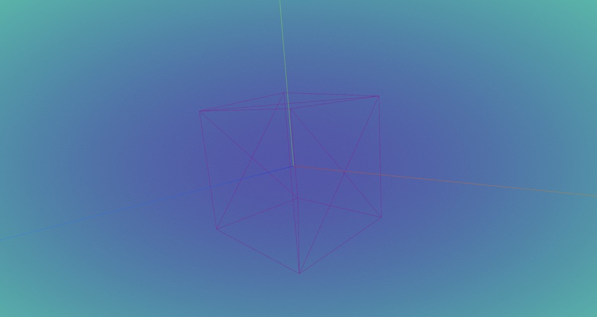

# Introdction

Copper3D is a library base on Three.js!

The main function for this library includes: multiple scene, gltfloader plugin, and GUI. In the future, this library also will develop MRI/nrrd loaders function. Although, threejs has already included those functions, this library will simplify the proccess of build a 3D visualization app by using these functions.

The main purpose of this library is to provide a stable loader function, a high quality model loading, and nice GUI control.

**Notice:**

Currently the library is under develop period, the npm package name is `temporary`, it will be `change` after.

- `Functions`
  - `Gltfloader plugin`
    Allows user to load multiple GLTF models in different pages with one WebGLRender.
    Allows user easily to control and interact with load models.
  - `GUI`
    A nice GUI for user to control and debug APP, and config background.
  - `Multiple Scenes`
    Allows user to create multiple scene in a signle page, and allows data sharing between each scene.
    Each scene can has its own GUI for Customization.
  - `MRI/NRRD Loader`
    A loader allows user easily to load MRI/NRRD images on a visualisation APP. And, it will provide a nice GUI for user to interact with customisation model and MRI/NRRD model.

## Base Implementation

### Install the library

Install the library in a visualisation APP (Vue, Vite, React)

- Demo use vite

  - Install

    ```bash
    mkdir demo-for-copper3d
    cd demo-for-copper3d
    npm init vite@latest
    cd your vite-app
    npm i gltfloader-plugin-test
    ```

  - Create a container for Copper3d Gltfloader plugin

    ```html
    <template>
      <div id="bg" ref="base_container"></div>
    </template>
    <style>
      #bg {
        width: 100vw;
        height: 100vh;
      }
    </style>
    ```

  - Load your first demo model.

    ```ts
    <script setup lang="ts">
        import * as Copper from "gltfloader-plugin-test";
        import { getCurrentInstance, onMounted } from "vue";
        let refs = null;
        let appRenderer: Copper.Renderer;
        onMounted(() => {
            let { $refs } = (getCurrentInstance() as any).proxy;
            refs = $refs;

            // get root container
            const bg: HTMLDivElement = refs.base_container;

            appRenderer = new Copper.Renderer(bg);

            const defaultScene = appRenderer.getCurrentScene();
            defaultScene.createDemoMesh();

            appRenderer.animate();
         });
    <script>
    ```

  - Results
    
