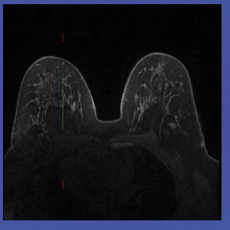

# Documentation for store mask data and transfer function in NRRD segmentation tools

## Introduction

Firstly, we should define something for us to explain:

1. Define our coordinates:

1. Define each position’s slices

- Slice xy: all slices on the z axis.

- Slice yz: all slices on the x axis.

- Slice xz: all slices on the y axis.

Then, suppose we load a nrrd file with dimension [448, 448, 160]. The dimension here means the total number of slices on each axis. For example:

- Dimension[0] is 448, this means there are a total 448 Slice yz on the x axis.
- Dimension[1] is 448, this means there are a total 448 Slice xz on the x axis.
- Dimension[2] is 160, this means there are a total 448 Slice xy on the x axis.

Thus, when we load the nrrd file, I create a dictionary to store each slice’s mask. The dictionary structure like this:

And we can imagine if we render the whole nrrd file (all slices with all directions), they will form a cube. And currently the display slice is slice xy at index number 80. So this slice xy will stay on the z-axis at 80 position, you can see the green line on the left.

Then the mask for this slice xy is stored in the dictionary in this position:
` `**const mask_image_array = dic.xy[80].**

All the **yellow slices** belong to **Slice yz**. We can also see that each position (pixel point) of the width of slice xy is related to each Slice yz.

All the **green slices** belong to **Slice xy**. We can also see that each position (pixel point) of the width of slice yz is related to each Slice xy.

All the **blue slices** belong to **Slice xz**. We can also see that each position (pixel point) of the height of slice xy / slice yz is related to each Slice xz.

## Implement transfer function

When we have these knowledge, we can implement the transfer function now.

For example, if we draw something on Slice xy index number 80. You can find a green shape on the Slice xy 80.

We can follow these steps below to transfer marked pixels to all Slice yz.

1. Get Slice xy index number 80 marked image array from JS canvas, notice this is a 1D array. In order to transfer the marked pixels to Slice yz, we need to convert this one-dimensional array to a two-dimensional array based on the pixels in each column of that image.

1. Here you can see each column pixels data should be put into its relate Slice yz. For example, the first column pixel data should be put into Slice yz index 0.

So, we can use a for loop to get each column pixel data and each related Slice yz mask image from the dictionary that we created before(index 0~447). Such as:

Slice yz index 0: **dic.yz[0]**

Slice yz index 1: **dic.yz[1]**

Slice yz index 2: **dic.yz[2]**

`           `.

`           `.

`           `.

Slice yz index 446: **dic.yz[446]**

Slice yz index 447: **dic.yz[447]**

1. Now we’ve already found out all the column pixels data and Slice yz's mask images corresponding to them. Then we need to understand where we need to put the column pixel data into its Slice yz's mask images. Here we know the current mask image is belong to Slice xy’s index 80, so we need to replace the all Slice yz’s 80th column pixel data.

 

As for transfering marked pixels to all Slice xz, we can do the same solution, but the only thing we need to change is that we need the current mask image’s horizontal/row pixel data rather than the vertical/column pixel data.

For the Slice xz’ mask images we can get them very easily via:

Slice xz index 0: **dic.xz[0]**

Slice xz index 1: **dic.xz[1]**

Slice xz index 2: **dic.xz[2]**

`           `.

`           `.

`           `.

Slice xz index 446: **dic.xz[446]**

Slice xz index 447: **dic.xz[447]**

Thus, the dictionary store’s all NRRD direction’s slices’ mask image array.

## Issues

Now, we already know how to implement the transfer function at a high level. But there is one issue that is the real NRRD each direction’s slices width,height, depth are not match the NRRD’s dimension. See the below image, the real width, height,depth for all slice images, but the dimension is [448,448,160] each represents the total index number of Slice yz, Slice xz, Slice xy.

Now the issue happens, such as there are 160 Slice xy images but the Slice yz image width is only 150!

I have two solutions to solve this problem.

First one: resize the slice image.

For example, current Slice xy image width and height are (363, 359), the width and height of Slice xz are (363, 150), the width and height of Slice yz are (150, 359).

We can resize their width and height base on the NRRD’s dimension, so the width and height for Slice xy are (448, 448), the width and height for Slice xz are (448,160), the width and height for Slice yz are (160,448).

**However, if we choose this way the image will be stretched or compressed！**

Second one: Mapping the Slice images to each axis.

For example, we can mapping all index of the Slice xy images into z axis(the Slice yz’s width), so we can do some converting things:

- Suppose the current Slice xy index number is 80, 81, 82
- The dimension of Slice xy (total index number) is 160
- The Slice yz’s image width is 150
  - Mapping Slice xy 80 to Slice yz: 150/160\*80 = 75
  - Mapping Slice xy 81 to Slice yz: 150/160\*81 = 75.9373
  - Mapping Slice xy 82 to Slice yz: 150/160\*82 = 76.875

Ideally, if the Slice yz’s width is same as the total number of Slices xy, 160. The Slice xy 80 should in Slice yz’s width 80 position, but now it only can stay in position 75:

**Here you can see the new problem coming, the decimals appear, the decimals can not be used as JS array index.**

And can not convert the mask image array to 2D array with decimals as index. In the other words, we can not get the column which includes decimals as index.

My solution is use Math.floor(150/160\*81) = 75, let the Slice xy 80 and 81 share the same mask image column pixel data. So the Slice xy 80 and 81 shared the same column pixel data which comes from Slice yz mask image width position 75.

But now the new Issue comes, if we only draw on one view (suppose Slice xy) and transfer pixels to other views (Slice yz, xz), there is no any issue. But if we continue to draw something on another view which already accepts the transfer data from one view. The issue will happen in the shared Slices.

For example, if we draw something on Slice xy index 80

Then we can use the crosshair function to jump to another view, suppose we jump to Slice yz view. We can get this:

Now, you can see the transfer function works well. Then let's draw something on this image using another colour.

Next, let’s back to Slice xy 80 and 81 see what’s happening:

Slice xy 80: Everything perfect!

Slice xy 81: issue happens there is a green line in the middle. This green line is also be put into the Slice xy 80, but in the image there is a mask here. They overlap in the same position, so there is no problem. But the Slice xy 81 shared the same column’s pixel data with Slice xy 80, and there is no mask on 81, so you can see the green line on 81.

This is very hard to remove, because we don’t know where the original mask image is. We only know it will happen in those images which share the same position when Mapping.
