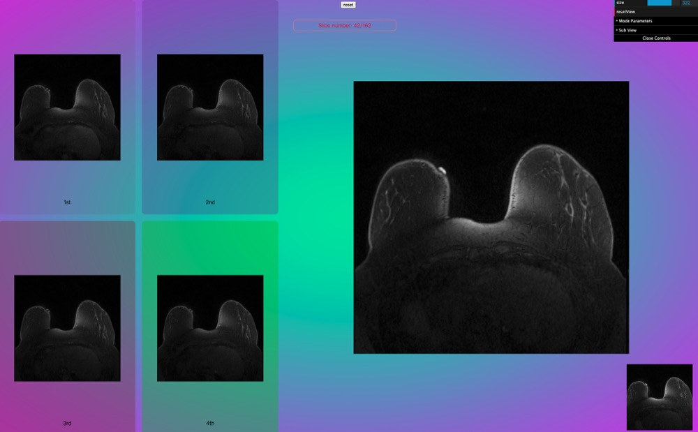

# Release

## Release v1.3.3

- Modify default scene name to `default`.
- Change the default background.

```js
const appRenderer = new Copper.Renderer(bg);
const defaultScene = appRenderer.getCurrentScene();
console.log(defaultScene.sceneName);
```

The result should be `"default"`.

## Release v1.3.4

- Add a method that can show/hide child mesh.

  ```ts
  let scene = appRenderer.createScene(name);
  if (child.isMesh) {
    scene.updateModelChildrenVisualisation(child);
  }
  ```

- Update GUI, allows user to show and hide child mesh under ModelFolder->ModelVisualisation folder.

Demo:


## Release v1.4.0

- add camera control in base GUI.
- pickModel

  - use raycaster to select model.
  - it has a callback function and a optional array parameter to sieve out models that users don't want.

    `callback function:` it will give the select mesh.

  - see `tutorial - pick model`.

- add a callback funtion in loadGltf function.
  - In the callback funtion, you can get your `gltf model`.
- change class `Renderer` to `copperRenderer`
- change class `Scene` to `copperScene`

## Release v1.4.1

- optimise pickModel function.

## Release v1.4.2

- modified pickModel callback function.

  if is picked the mesh will be returned.
  if picked null, the mesh will return undefined.

## Release v1.4.3

- export copperScene type -- `copperScene`
- export viewpoint type -- `CameraViewPoint`
- add updateCamera function
  - same as loadView function

## Release v1.4.4

- setViewPoint(camera: THREE.PerspectiveCamera,target?: number[])
  - return viewPoint
- getViewPoint()
  - Returns the default viewpoint, i.e. the viewpoint that was available when the user loaded the model.
- resetView()

## Release v1.4.5

- add `isHalfed` attribute in copperScene
  - the default value is `false`
  - when user call scene.updateModelChildrenVisualisation(), the value will changed.

## Release v1.5.0

- setPlayRate(playRate:number)
- getPlayRate()
  - retrun current play rate
- addLabelToScene(scene, text, x, y, z, scaling)

  - scene: copperScene
  - text: string
  - x,y,z: tag position
  - scaling: scale

- convert3DPostoScreenPos(container: HTMLDivElement | HTMLCanvasElement,
  camera: THREE.PerspectiveCamera,
  mesh: THREE.Object3D | THREE.Mesh | THREE.Sprite)

  - Give a 3D object, it will return a screen postion for you.

- convertScreenPosto3DPos(container: HTMLDivElement | HTMLCanvasElement,
  camera: THREE.PerspectiveCamera,
  pos: screenPosType)

  - Give the screen position, it will return a threejs 3d position for you.
  - you can customise z position.

- export two position type
  - positionType
    ```ts
    positionType {
      x: number;
      y: number;
      z: number;
    }
    ```
  - screenPosType
    ```ts
    screenPosType {
      x: number;
      y: number;
    }
    ```
- Add nrrdloader
  - loadNrrd(url: string, callback?: (volume: any) => void, opts?: optsType)
    `optsType`:
    ```ts
    interface optsType {
      openGui: boolean;
      container?: HTMLDivElement;
    }
    ```
  - addBoxHelper(scene: copperScene,volume: any, boxCube?:THREE.Object3D)
    This function can work with loadNrrd function

More information see `tutorial 07`

## Release v1.5.1

- fix bug default gui error.
- add preRenderCallback function.

## Release v1.5.3

- Optimize render PixelRatio
- add a fullscreen method
  - fullScreenListenner(bg: HtmlDivElement)
  ```ts
  document.addEventListener("keydown", (e) => {
    if (e.code === "KeyF") {
      appRenderer.fullScreenListenner(bg);
    }
  });
  ```

## Release v1.6.0

- update default gui options
  ```js
  appRenderer = new Copper.copperRendererOnDemond(bg, {
    guiOpen: true,
    camera: true,
    performance: true,
    light: true,
  });
  ```
- Optimize resize render performance
- add copperRenderOnDemond class
- add copperSceneOnDemond class
  - Minimal memory consumption for on-demand rendering

See tutorial 08

## Release v1.7.0

- Add multiple scenes function.

  - users can setup mutiple scene in a single page with only one WebGLRenderer and canvas.

  - update raycaster function

  - copperMSceneRenderer(bg:HtmlDivElement, 3: numerOfScene);

  - Useage:

  ```ts
  import * as Copper from "gltfloader-plugin-test";
  import "gltfloader-plugin-test/dist/css/style.css";
  appRenderer = new Copper.copperMSceneRenderer(bg, 3);
  ```

See tutorial 09

## Release v1.8.0

- update nrrdloader callback function

  - currently, it will return `volume` and `GUI`

- fix background error

- Add create demo model function in copperMScene class

- update controls rotate speed

- update addLabelToScene(copperScene,text,x,y,z,scale,fontOption) function
  - fontOption
    ```ts
      {
          font_size: "50px",
          font: "Raleway",
      }
    ```
    see toturial 6

## Release v1.8.1

- add setModelPosition(medel:THREE.Group|THREE.Mesh,position:{x:number,y:number,z:number}) in `copperScene`.

## Release v1.8.2

- add loadnrrd texture volume method.

## Release v1.8.3

- add kiwrious
- add volume mesh in nrrdloader callback function

## Release v1.8.8

- fixed kiwrious error
- add kiwrious types
  - more information see `toturial 10`
- update nrrdloader function
  - Now the nrrdloader will not automatcially add slices (x,y,z) for you. But it add a callback function parameter to return x,y,z slices. So, Users can add slices according to their preferences. `see toturial 07`

## Release v1.8.10

- update kiwrious copper3d plugin package
- add docs for developing nuxtjs

## Release v1.8.11

- optimize raycaster function

- add a ispickisPickedModel(camera,
  container,
  pickableObjects,
  mouseMovePosition
  ) in raycaster

  - camera: THREE.PerspectiveCamera,
  - container: HTMLDivElement,
  - pickableObjects: THREE.Mesh[],
  - mouseMovePosition: mouseMovePositionType
  - return: THREE.Object3D<THREE.Event> | null

- add pickSpecifiedModel( content, mousePosition) in copperMScene

  - content: THREE.Mesh | Array<THREE.Mesh>,
  - mousePosition: mouseMovePositionType
  - return: THREE.Object3D<THREE.Event> | null

- mouseMovePositionType in types

  ```js
  interface mouseMovePositionType {
    x: number;
    y: number;
  }
  ```

## Release v1.8.12

- fix bugs in copperMScene
  - use the Array.isArray() instead of using vue isArray()

## Release v1.8.13

- type:

  - positionType (with optional)
    ```ts
    interface positionType {
      x?: number;
      y?: number;
      z?: number;
    }
    ```
  - nrrdSliceType, nrrdDragImageOptType and nrrdModeType

    ```ts
    type nrrdModeType = "mode0" | "mode1";

    interface nrrdDragImageOptType {
      mode?: nrrdModeType;
      showNumber?: boolean;
    }
    interface nrrdSliceType {
      x: any;
      y: any;
      z: any;
    }
    ```

- copperMScene:

  - updateCamera() same to copperScene

  - resetView() same to copperScene

  - setCameraPosition(position:positionType)
    Give the position where you want the camera to be located. it will update the camera viewPoint and scene viewPoint. so that you can use resetView() function after.
  - dragImage(slice: any, opts?: nrrdDragImageOptType)
    - `slice`: give the nrrd slice, such as sliceX, sliceY, sliceZ
    - `opts`: it's optional, default mode is mode1, default showNumber is false. if the showNumber is true, it will create div to display current slice number, you can edit the .copper3d_sliceNumber in css. such as:
      ```css
      .copper3d_sliceNumber {
        top: 50px !important;
        left: 150px !important;
        border: 1px solid salmon;
        border-radius: 10px;
        padding: 5px;
      }
      ```
  - loadNrrd(): callback function update, now it add a new parameter to return slices. how to use see tutorial 12.

- copperNrrdLoader:

  - dragImageWithMode(container: HTMLDivElement, controls: TrackballControls, slice: any, opts?: nrrdDragImageOptType): for copperMScene dragImage().

  - createShowSliceNumberDiv(): for opts.showNumber = true

- how to use drag

  - step1: select the scene that you want to control with your mouse.
  - step2: press any `shift` key on your keyborad.
  - step3: `click` your mouse on nrrd image and `drag`.

See tutorial 12 - drag and reset nrrd image.

## Release v1.8.14

- update cursor, when user use drag nrrd function.
- change cameraPositionType in copperMSceneRenderer to positionType.
- clean code.

## Release v1.8.15

- fixed addlight AmbientLight and DirectionalLight not work in GUI bug.

## Release v1.8.16

- fixed guiOpen = false bug.

## Release v1.8.17

- fixed copperMScene gui bug
- developing draw gui
- draw gui mode1.

## Release v1.8.18

- developed draw image mode 2 and mode3
- now user can draw on canvas.
  - change the color.
  - change the drawing size.
  - use eraser.
  - clear all drawing.
  - download current image.
- create loading animation.

## Release v1.8.19

- update threejs version to latest.

## Release v1.8.20

- update drawing funtion
- currently only has mode2.
- add segmentation method.

## Release v1.8.21

- add subview function in copperMScene
  when we use it, we can call addSubView(), after we initialise copperMSceneRenderer.
- Then when the model loaded, we can add it to subScene.

See toturial 14

## Release v1.8.22

- fixed gui bug
- update drawing function colors.

## Release v1.8.23

- add vtk loader
- create a load multiple vtks function
- fixed drawing function bugs.

## Release v1.8.24

- Fixed drawing function bugs

## Release v1.8.25

- add load mutiple vtk files function with animation.

## Release v1.8.26

- update load mutiple vtk files function. Now user should follow this type to sent parameter.
  ```ts
  scene?.loadVtks([
    { name: "heart_inner", urls },
    { name: "heart_outer", urls: urls_1 },
  ]);
  ```
- add gltf exporter.

## Release v1.9.1

- Main update on Painting function.

  - fixed clear all function bug.
  - add brush
  - more easier to zoom image. (use mouse wheel to zoom).
  - more easier to pan image. (use mouse right click to pan).
  - change slice still apply (press shift do not release, then use mouse lift click to drag image).
  - Add undo funtion. (In GUI click undo, on keyborad using ctrl+z (windows) / command+z(mac) ).

- Update core Painting function.

- demo
<iframe 
src="../_static/video/drawing_demo.mp4" 
scrolling="no" 
border="0" 
frameborder="no" 
framespacing="0" 
allowfullscreen="true" 
height=600 
width=800> 
</iframe>

## Release v1.9.2

- update CopperScene

## Release v1.10.0

- create a dicom loader
- add render texture 2d method

## Release v1.10.2

- add contrast gui controller in painting function.

## Release v1.10.3

- fix contrast gui with wheel bug.

## Release v1.10.4

- fixed switch slice bug
- add control contrast gui on 2d dynamic image.

## Release v1.10.5

- Refactoring paint code
- delete drag and draw funtion in copperMScene
- now use `new Copper.nrrd_tools()`

  ```ts
  nrrdTools = new Copper.nrrd_tools(volume, nrrdSlices.z);
  /**
   * for drag image
   * */
  nrrdTools.dragImageWithMode(
    sceneIn.container,
    sceneIn.controls as TrackballControls,
    {
      mode: "mode1",
      showNumber: true,
    }
  );
  /**
   * for draw image
   * */
  nrrdTools.draw(
    sceneIn.container,
    sceneIn.controls as TrackballControls,
    sceneIn,
    sceneIn.gui
  );
  ```

## Release v1.11.0

- update loading function
  - now we need to create the loading manunally, and we can specify where it appears.
  ```ts
  let loadBar: Copper.loadingBarType;
  loadBar = Copper.loading();
  nrrdTools.mainDisplayArea.appendChild(loadBar.loadingContainer);
  sceneIn?.loadNrrd(url, loadBar, funa);
  ```
- Update nrrdTools

  - add show contrast display

  ```ts
  let nrrdTools: Copper.nrrd_tools;
  nrrdTools = new Copper.nrrd_tools(appRenderer.sceneInfos[0].container);
  nrrdTools.addContrastDisplay();
  nrrdTools.setVolumeAndSlice(volume, nrrdSlices.z);

  nrrdTools.dragImageWithMode(sceneIn.controls as TrackballControls, {
    mode: "mode1",
    showNumber: true,
  });
  nrrdTools.draw(sceneIn.controls as TrackballControls, sceneIn, sceneIn.gui);
  appRenderer.sceneInfos[0].addPreRenderCallbackFunction(nrrdTools.start);
  ```

## Release v1.11.1

- update the nrrdTools costomer css.
  - define css class name for each contrast area and main area
  - we can write our custom css out side
  ```css
  .copper3D_scene_div {
    display: grid;
    grid-template-areas:
      "c1 c2 m m m "
      "c1 c2 m m m "
      "c3 c4 m m m "
      "c3 c4 m m m ";
    gap: 10px;
  }
  .copper3D_mainDisplay {
    position: relative;
    grid-area: m;
  }
  .copper3D_contrast1 {
    grid-area: c1;
    background-color: rgba(130, 39, 39, 0.1);
  }
  .copper3D_contrast2 {
    grid-area: c2;
    background-color: rgba(102, 51, 153, 0.3);
  }
  .copper3D_contrast3 {
    grid-area: c3;
    background-color: rgba(126, 60, 60, 0.4);
  }
  .copper3D_contrast4 {
    grid-area: c4;
    background-color: rgba(45, 192, 19, 0.4);
  }
  ```
- update functions for nrrd contrast
  ```ts
  nrrdTools.setContrast1OriginCanvas(nrrdSlices.z);
  nrrdTools.setContrast2OriginCanvas(nrrdSlices.z);
  nrrdTools.setContrast3OriginCanvas(nrrdSlices.z);
  nrrdTools.setContrast4OriginCanvas(nrrdSlices.z);
  nrrdTools.setContrastSize(size, size);
  nrrdTools.updateContrastArea();
  ```
- result
  

## Release v1.11.2

- design drag function for contrast area
- design change contrast value function

## Release v1.11.3

- update copperMScene controls

  - now we can switch the controls outside by using `setControls(1)`
    - 0: OrbitControls
    - other numbers: TrackballControls.

  ```ts
  appRenderer.sceneInfos[0].setControls(1);
  ```

  - the default controls is OrbitControls now.
  - if when you switch to TrackballControls, the speed is not that you want, you can adjust it outside by using e.g, `.rotateSpeed = 0.1`.

- In order to improve the paint performance, remove the requestAnimationFrame function from paint method. Then add `addPreRenderCallbackFunction` in copperMScene. Now when we use nrrd_tools class, after we call the draw function, we need to put the `nrrdTools.start` in addPreRenderCallbackFunction array to call it in requestAnimationFrame

```ts
let nrrdTools: Copper.nrrd_tools;
nrrdTools = new Copper.nrrd_tools(appRenderer.sceneInfos[0].container);
nrrdTools.addContrastDisplay();
nrrdTools.setVolumeAndSlice(volume, nrrdSlices.z);

nrrdTools.dragImageWithMode(sceneIn.controls as TrackballControls, {
  mode: "mode1",
  showNumber: true,
});
nrrdTools.draw(sceneIn.controls as TrackballControls, sceneIn, sceneIn.gui);
appRenderer.sceneInfos[0].addPreRenderCallbackFunction(nrrdTools.start);
```

## Release v1.11.4

- add callback function for loadDicom, it will return the mesh.
  ```ts
  // usrls: required
  // callback: optional
  // gui: optional
  scene.loadDicom(
    urls,
    (mesh) => {
      console.log(mesh);
    },
    gui
  );
  ```
- fixed the loadDicom bug, now the performance has been improved.
- add setDepth() in copperScene.
  - Now, we can use `setDepth(value:number)` to set the Dicom texture mesh animation speed.

## Release v1.11.5

- changed loading bar function.

## Release v1.11.6

- update and impove the core painting function.
  - now the performance get a huge impoved again.
- fixed loadingBar issue.
- fixed running memory issue .
- fixed draw segmentaion circle cause painted image disappear issue.

## Release v1.11.7

- developed show all contrast images in main area.

  ```ts
  appRenderer = new Copper.copperMSceneRenderer(bg, 1);
  nrrdTools = new Copper.nrrd_tools(appRenderer.sceneInfos[0].container);
  nrrdTools.setContrastDisplayInMainArea();
  ```

- For how to address multiple loadingBar issue, we can just create one loadingBar, then use this loadingBar in each NRRD loader.

  ```ts
  loadBar1 = Copper.loading();
  nrrdTools.mainDisplayArea.appendChild(loadBar1.loadingContainer);
  sceneIn?.loadNrrd(
    "/copper3d_examples/nrrd/segmentation/ax dyn 1st pass.nrrd",
    loadBar1,
    contrast1Area
  );
  sceneIn?.loadNrrd(
    "/copper3d_examples/nrrd/segmentation/ax dyn 2nd pass.nrrd",
    loadBar1,
    contrast2Area
  );
  sceneIn?.loadNrrd(
    "/copper3d_examples/nrrd/segmentation/ax dyn 3rd pass.nrrd",
    loadBar1,
    contrast3Area
  );
  ```

- Fixed undo issue.

- Optimised dicom loader.

## Release v1.11.8

- fixed dicom loader disoder issue after load all dicom files.
  - the default order is ascending order.
- add set order function in copperScene.
  ```ts
  scene.setDicomFilesOrder("descending"); // value => "ascending" | descending
  // set order must before load function
  scene.loadDicom(
    urls,
    (mesh) => {
      console.log(mesh);
    },
    gui
  );
  ```

## Release v1.11.9

- Refactoring the nrrd_tools drag function code.

  - now we can use click function to switch slices.

  ```ts
  // must be call before updateIndex function
  nrrdTools.setSyncsliceNum();
  // sliceNum: changed slice move step
  nrrdTools.updateIndex(sliceNum);
  ```

- add a getMaxSliceNum() function.

  - this function will return the total number of slices.

  ```ts
  let max = ref(0);
  max.value = nrrdTools.getMaxSliceNum();
  ```

## Release v1.11.10

- Removing `nrrdTools.updateIndex(sliceNum);` function.

  - Now we use this function instead, and no longer using `setSyncsliceNum()` before call it.

  ```ts
  //nrrdTools.setSyncsliceNum(); // no longer to use it.
  nrrdTools.setSliceMoving(sliceNum);
  ```

- fixed painting bug when using click function to switch slices.

## Release v1.11.11

- fixed the mouse wheel bug.
  - Now, when user use mouse wheel to resize the painting area, the painting function will aotumatically stop after one second.

## Release v1.11.12

- add css classname `copper3D_loading_progress` for progress text.

  - Now, user can customise the text colors.

  ```css
  .copper3D_loading_progress {
    color: crimson !important;
  }
  ```

  ## Release v1.11.13

  - Modify `loadDicom` function in copperScene.

    - remove `gui` and `callback` parameters
    - using opts to instead.
    - optsType:
      ```ts
      interface dicomLoaderOptsType {
        gui?: GUI;
        getMesh?: (mesh: THREE.Mesh) => void;
        setAnimation?: (
          currentValue: number,
          depth: number,
          depthStep: number
        ) => number;
      }
      ```

  - How to use now:

  ```ts
  scene.loadDicom(urls, {
    gui,
    getMesh(mesh) {
      console.log(mesh);
    },
    setAnimation(currentValue, depth, depthStep) {
      currentValue += depthStep;
      if (currentValue > depth) {
        currentValue = 0;
      }
      return currentValue;
    },
  });
  ```

- optimise the preRenderCallbackFunction.

  - The problem of repeatedly adding functions can now be circumvented.
  - The usage is same as before.

## Release v1.11.14

- Modify the nrrd_tools `setVolumeAndSlice(volume: any, slice: any, notMainArea?: boolean)` with a optional parameter.
  - if you want to render all contrast nrrd in a same page, you can sent `true` to third parameter.
  - How to use it see `Tutorial 15`
- Add a brush Mouse Assistance System.

## Release v1.11.15

- change back `setVolumeAndSlice(volume: any, slice: any, notMainArea?: boolean)` to `setVolumeAndSlice(volume: any, slice: any)`.

- add drag sensitive attribute in GUI.

## Release v1.11.17

- optimise Nrrd_tools GUI
- optimise drag sensitive parameter

## Release v1.11.18

- Set Nrrd tools subview default to none.

## Release v1.11.19

- rewrite copperScene
- add all common methods in commonSceneMethod class. Then let copperScene and copperMScene to extends it.

## Release v1.11.20

- update nrrd tools getMaxslice method.
- changed the nrrd tools `setContrastDisplayInMainArea(filesNum: number)` method.
  - now you need to tell the tool, how many files you uploaded.
  ```ts
  nrrdTools.setContrastDisplayInMainArea(5);
  ```

## Release v1.11.21

- add a `redrawPreCanvas()` method in nrrd_tools.
  - this is used for hide/show contrast function.

## Release v1.11.22

- remove `redrawPreCanvas()`
- make `redrawDisplayCanvas()` private to public. And use it to instead of redrawPreCanvas()
- rewrite `redrawDisplayCanvas()`
- changed mask, now one mask used for all contrast images.

## Release v1.11.23

- update brush Mouse Assistance System
  - changed filled to outlined.

## Release v1.11.24

- add a callback function in nrrd_tools `dragImageWithMode` opts parameter.

  - now through the callback (getSliceNum) function we can get slice and contrast number.

  ```ts
  let immediateSliceNum = ref(0);
  let contrastNum = ref(0);
  const getSliceNum = (index: number, contrastindex: number) => {
    immediateSliceNum.value = index;
    contrastNum.value = contrastindex;
  };

  nrrdTools.dragImageWithMode(scene?.controls as TrackballControls, {
    mode: "mode1",
    showNumber: true,
    getSliceNum,
  });
  ```

- Changed the way drag and paint operate

  - users can use mouse left click to drag.
  - if paint, users need to press shift key, then paint the image.

- changed the default drag sensitive value to 50.

## Release v1.11.25

- fixed the nrrd_tool bugs:

  - [x] (Solved) paint on contrast images: after painting and switching images, the before-painting things will disappear!
  - [x] (Solved) zoom: After using the drag function, the wheel function will fail to work.
  - [x] (Solved) loose focus: every time switch between GUI and paint area, the mouse will lose focus on the paint div.

- Fixed the subview gui issue.

  - before, if user not choose to use subview function, the subview gui will continue appear in GUI.
  - now solved!

- provide a reset main paint area size API for user in nrrd_tool.

```ts
const resetMainAreaSize = (factor: number) => {
  nrrdTools.setMainAreaSize(factor);
};
```

## Release v1.11.26

- Fixed the bug:
  - Mouse wheel function has conflict with drag function on Mac.

## Release v1.11.27

- Refactoring nrrd_tools code

  - now when we use nrrd_tools,

    ```ts
    nrrd_c = $refs.nrrd_c;
    nrrdTools = new Copper.nrrd_tools(nrrd_c);
    watchEffect(() => {
      if (
        readyMain.value &&
        readyC1.value &&
        readyC2.value &&
        readyC3.value &&
        readyC4.value
      ) {
        console.log("All files ready!");
        allSlices.sort((a: any, b: any) => {
          return a.order - b.order;
        });

        nrrdTools.setAllSlices(allSlices);
        const getSliceNum = (index: number, contrastindex: number) => {
          immediateSliceNum.value = index;
          contrastNum.value = contrastindex;
        };
        nrrdTools.drag({
          showNumber: true,
          getSliceNum,
        });
        nrrdTools.draw(scene as Copper.copperScene, gui);
        scene?.addPreRenderCallbackFunction(nrrdTools.start);
        max.value = nrrdTools.getMaxSliceNum()[0];
      }
    });
    ```

  - As for the drag:
    - removed mode parameter, and controls
  - In terms of draw:
    - remove controls parameter

- more info see tutorial 16

## Release v1.11.28

- fixed download image issue!

## Release v1.11.29

- update docs
- delete useless code in nrrd_tools
- impove the performance!

## Release v1.11.30

- update tutorial 16
- update setShowInMainArea()
  - now when use this function, it will automatically call redrawMianPreOnDisplayCanvas()
- add getIsShowContrastState()

  - return showContrast state: boolean

    ```ts
    const status = nrrdTools.getIsShowContrastState();
    if (status) {
      max.value = nrrdTools.getMaxSliceNum()[1];
    } else {
      max.value = nrrdTools.getMaxSliceNum()[0];
    }
    ```

- add `setSliceOrientation(axis: "x" | "y" | "z") ` function

  - switch x,y,z orientation for slices

  ```ts
  const resetSlicesOrientation = (axis: "x" | "y" | "z") => {
    nrrdTools.setSliceOrientation(axis);
    const status = nrrdTools.getIsShowContrastState();
    if (status) {
      max.value = nrrdTools.getMaxSliceNum()[1];
    } else {
      max.value = nrrdTools.getMaxSliceNum()[0];
    }
  };
  ```

## Release v1.11.31

- fixed switch nrrd orientation slice num bug

## Release v1.11.32

- set dragSensitivity default value to 75.
- set the init slice index value to half of max index num.

## Release v1.11.33

- fixed the pan function bug issue:#109
- fixed the painting function bug issue:#110

## Release v1.11.34

- modified the redrawMianPreOnDisplayCanvas()

  - when use it, it will aotumatically resize the mainArea.

- Add a clear method in nrrd_tools

  - this function is called to reset all parameters in nrrd_tools. In order to reload other nrrd files for preparation.

  ```ts
  nrrdTools.clear();
  nrrdTools.setAllSlices(allSlices);
  if (firstLoad) {
    nrrdTools.drag({
      showNumber: true,
      getSliceNum,
    });
    nrrdTools.draw(scene as Copper.copperScene, gui);

    scene?.addPreRenderCallbackFunction(nrrdTools.start);
  } else {
    nrrdTools.redrawMianPreOnDisplayCanvas();
  }
  firstLoad = false;
  ```

- solved issues #86 #87

- As for how to use, see tutorial 16.

## Release v1.12.0

- reset segmentation for painting function default method.
- build addSkip and removeSkip method in nrrd_tools for user to switch contrast outside.
- how to use, see tutorial 16.

## Release v1.12.1

- optimise nrrd_tools.
- Fixed some potential bugs. such as:
  - cannot find out mainPreSlice.
  - slice index update errors.

## Release v1.12.2

- update nrrd_tools GUI layout

## Release v1.12.3

- add a confirm box when using clearAll function in nrrd_tools.

## Release v1.12.4

- set the default opacity to 0.5
- add arrow keys (up & down) to switch slices.
- add a reset zoom button in the GUI.
- renamed the clearAll to clear, and add a warning confirmation box with using this function.
- add a clearAll function in GUI, to clear all paintings.

## Release v1.12.5

- fixed bug:
  - reset zoom, after changing the slice's orientation, the size will back.

## Release v1.12.6

- changed arrow key logic for switching slices:
  - up to decrease slice's number.
  - down to increase slice's number.
- fixed the performance issue on drag slice and painting function.
  - dynamicaly remove the timer
- fixed bug: images contrast not work with selecting contrast function.

## Release v1.12.7

- reset opacity to 0.35.
- remove warning msg for clear function.

## Release v1.12.8

- reset opacity to 0.7.
- modify Zoom function to fixed-point magnification base on mouse position.
- Repackaged nrrd slice:
  - slice.initIndexZ
  - slice.initIndexY
  - slice.initIndexX
  - slice.ratioZ
  - slice.ratioY
  - slice.ratioX
- add a ratio attribute in slice to help converting RSADimention to nomal Dimention.
- fixed the slice index bug.

## Release v1.12.9

- add mouse cursor option in nrrd_tools GUI.

## Release v1.12.10

- update nrrd_tools GUI opacity.

## Release v1.12.11

- fixed all NRRD slice index error.
  - threejs environment is base on RSADimention to render the nrrd each slices. But in this way, The slice presented by threejs does not match the real nrrd slice. Actually, one nrrd slice should represent one dicom file image. Thus, we need use `voxel spacing` to fix this issue.
  - Suppose we want to get the index 10 slice image. which is 10th dicom file image. Using multiplication: we can use the index 10 to times voxel spacing to get the 10th dicom file image in threejs environment.
- update copper3d nrrd loader, in order to match the real nrrd slice, all position max slice index minus 1.
- update nrrd_tools GUI some parameters name.

## Release v1.12.12

- fixed switch display contrasts issues
  - using a skipSlicesDic dictionary to store all remain contrast images, and the removed contrast images' index numbers.
  - add a skipSlicesDic type.
  - add a clearDictionary() function to reset dictionary.

## Release v1.12.13

- remove useless code.

## Release v1.12.14

- remove arrow key function in nrrd tools.
- add using cursor function to selete the point position on NRRD slice via crosshair.
  - press `s` on keyboard to use this function.

## Release v1.12.15

- Add basic logic for crosshair system.
  - Now when using crosshair system mode, when user click the cursor on nrrd slice and use the switch orientation function, the next position's slice index will base the click point.

## Release v1.12.16

- fixed the crosshair system bug.
- add `getCurrentSlicesNumAndContrastNum()`, it will return current index number and contrast index number.

## Release v1.12.17

- solved the crosshair Inaccuracy issue.

  - Notice: the real cursor x is releted slice's RASDimension, but in copper3d system the slice index is releted to slice's dimension. So we need to do some convert things!
  - z -> x:
    slice_z cursor x is slice_x's index, so we need to convert cursor x to slice's dimension format.
    slice_z's index is slice_x cursor x, so we need to convert the dimention to RASDimention.
  - z -> y:
    slice_z's cursor y is slice_y's index
    slice_z's index is slice_y's cursor y
  - x -> z:
    slice_x's cursor x is slice_z's index
    slice_x's index is slice_z's cursor x
  - x -> y:
    slice_x's cursor y is slice_y's index
    slice_x's index is slice_y's cursor x
  - y -> z:
    slice_y's cursor y is slice_z's index
    slice_y's index is slice_z's cursor y
  - y -> x:
    slice_y's cursor x is slice_x's index
    slice_y's index is slice_x's cursor y

## Release v1.12.18

- Add cursor dot in nrrd_tools GUI.
