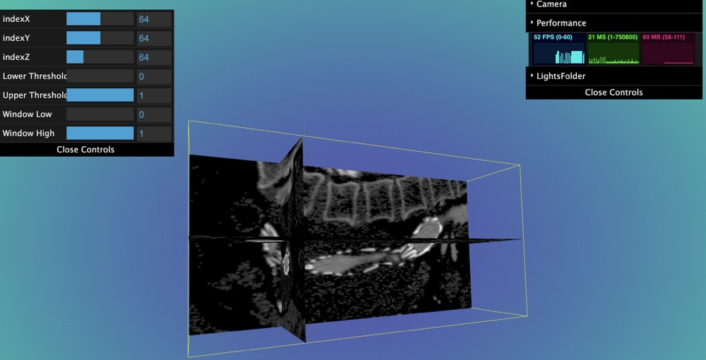

# Load Nrrd Image

- Config html

```html
<template>
  <!-- <div id="bg" ref="base_container" @click="getPosition"> -->
  <div id="bg" ref="base_container">
    <div ref="c_gui" id="gui"></div>
    <div class="btn">
      <button @click="loadNrrd('/nrrd/stent.nrrd', 'nrrd')">LoadNrrd</button>
    </div>
  </div>
</template>

<style>
  #bg {
    width: 100vw;
    height: 100vh;
  }
  .btn {
    position: fixed;
    left: 0;
    top: 0;
  }
  button {
    cursor: pointer;
    margin: 10px;
  }
  #gui {
    position: absolute;
    top: 50px;
    left: 2px;
  }
</style>
```

- Setup Copper render environment

```ts
import * as Copper from "gltfloader-plugin-test";
import { getCurrentInstance, onMounted } from "vue";
let refs = null;
let appRenderer: Copper.copperRenderer;
let bg: HTMLDivElement;
let c_gui: HTMLDivElement;

onMounted(() => {
  let { $refs } = (getCurrentInstance() as any).proxy;
  refs = $refs;

  bg = refs.base_container;
  c_gui = refs.c_gui;

  appRenderer = new Copper.copperRenderer(bg, { guiOpen: true });
  appRenderer.gui.closed = true;

  appRenderer.animate();
});
```

- load nrrd

```ts
function loadNrrd(url: string, name: string) {
  scene = appRenderer.getSceneByName(name);
  if (scene == undefined) {
    scene = appRenderer.createScene(name);
    if (scene) {
      appRenderer.setCurrentScene(scene);
      scene?.loadNrrd(url);
      //   load image view
      scene.loadViewUrl("/nrrd_view.json");
    }
  }
}
```

- If you want setup or get volume, you can add a callback function

```ts
function loadNrrd(url: string, name: string) {
  scene = appRenderer.getSceneByName(name);
  if (scene == undefined) {
    scene = appRenderer.createScene(name);

    /*add a callback function to get volume*/

    const getVolume = (volume: any, nrrdMesh: Copper.nrrdMeshesType) => {
      sceneIn.addObject(nrrdMesh.x);
      sceneIn.addObject(nrrdMesh.y);
      sceneIn.addObject(nrrdMesh.z);
      Copper.addBoxHelper(scene as Copper.copperScene, volume);
    };

    if (scene) {
      appRenderer.setCurrentScene(scene);
      scene?.loadNrrd(url, getVolume);
      scene.loadViewUrl("/nrrd_view.json");
    }
  }
}
```

- If you want to open default gui

```ts
function loadNrrd(url: string, name: string) {
  scene = appRenderer.getSceneByName(name);
  if (scene == undefined) {
    scene = appRenderer.createScene(name);

    const opts: Copper.optsType = {
      openGui: true,
      container: c_gui,
    };
    const getVolume = (
      volume: any,
      nrrdMesh: Copper.nrrdMeshesType,
      gui?: GUI
    ) => {
      sceneIn.addObject(nrrdMesh.x);

      Copper.addBoxHelper(scene as Copper.copperScene, volume);
      (gui as GUI).closed = true;
    };
    if (scene) {
      appRenderer.setCurrentScene(scene);
      scene?.loadNrrd(url, getVolume, opts);
      scene.loadViewUrl("/nrrd_view.json");
    }
  }
}
```

- Result


