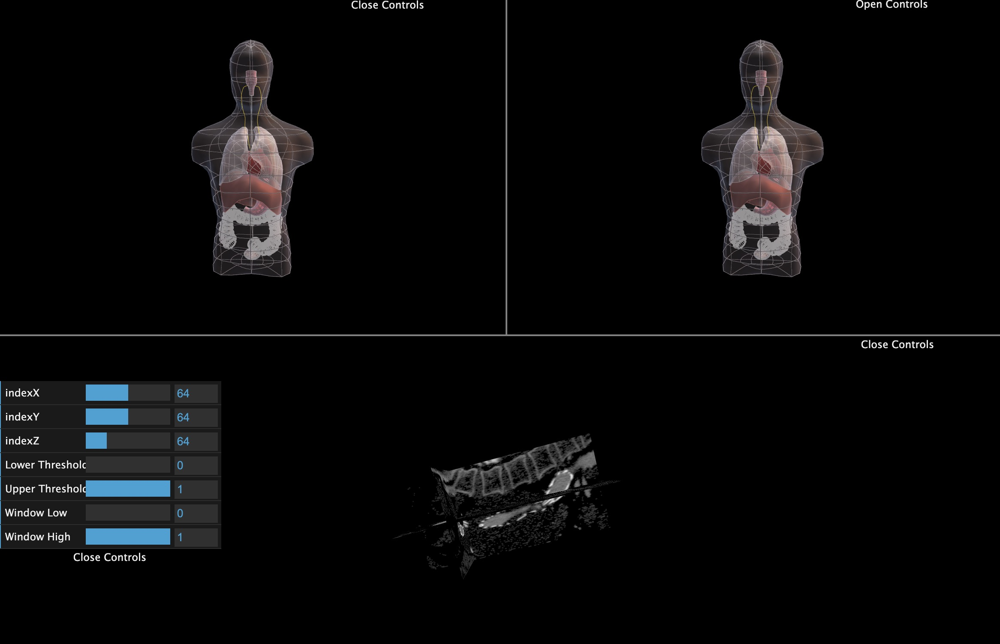

# Multiple Scenes

- setup base environment

```html
<template>
  <div id="bg" ref="base_container">
    <div ref="c_gui" id="gui"></div>
  </div>
</template>
<style lang="scss" scoped>
  #bg {
    width: 100vw;
    height: 100vh;
  }
  .btn {
    position: fixed;
    left: 0;
    top: 0;
  }
  button {
    cursor: pointer;
    margin: 10px;
  }
  #gui {
    position: absolute;
    top: 450px;
    left: 2px;
    z-index: 100;
  }
</style>
```

- config copper

```ts
import * as Copper from "gltfloader-plugin-test";
import "gltfloader-plugin-test/dist/css/style.css";
import { getCurrentInstance, onMounted } from "vue";

let refs = null;
let bg: HTMLDivElement;
let appRenderer: Copper.copperMSceneRenderer;
let c_gui: HTMLDivElement;

onMounted(() => {
  let { $refs } = (getCurrentInstance() as any).proxy;
  refs = $refs;
  bg = refs.base_container;
  c_gui = refs.c_gui;

  appRenderer = new Copper.copperMSceneRenderer(bg, 3);

  loadModel("/test.glb", "test", appRenderer.sceneInfos[0]);
  loadModel("/test.glb", "test", appRenderer.sceneInfos[1]);
  loadNrrd(
    "/copper3d_examples/nrrd/stent.nrrd",
    "nrrd",
    appRenderer.sceneInfos[2]
  );

  appRenderer.animate();
});
```

- result


