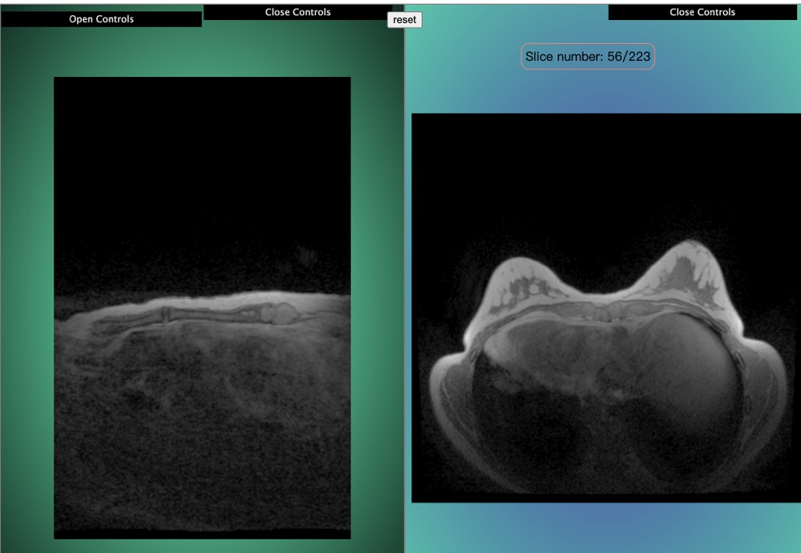
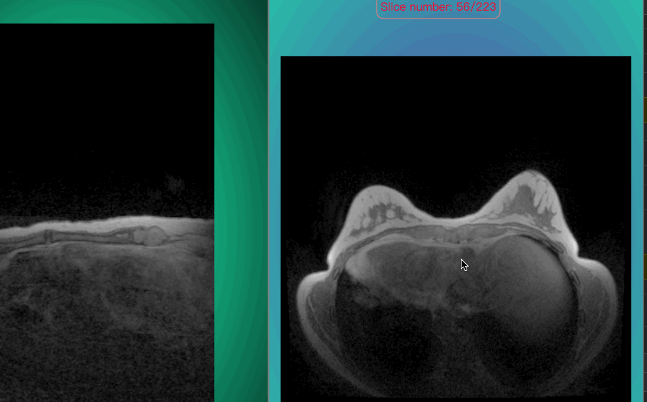

# Drag and Reset Nrrd image

- setup html

  ```html
  <template>
    <div id="bg" ref="base_container">
      <div ref="c_gui" id="gui"></div>
      <div ref="c_gui_2" id="gui_2"></div>
      <button class="btn" ref="btn" @click="reset">reset</button>
    </div>
  </template>
  <style lang="scss">
    #bg {
      width: 100vw;
      height: 100vh;
      /* border: 1px solid palevioletred; */
    }
    .btn {
      position: fixed;
      left: 500;
      top: 0;
      z-index: 1000;
    }
    button {
      cursor: pointer;
      margin: 10px;
    }
    #gui {
      position: absolute;
      top: 10px;
      left: 2px;
      z-index: 100;
    }
  </style>
  ```

- config copper3d

  ```ts
  import { GUI } from "dat.gui";
  import * as Copper from "gltfloader-plugin-test";
  import "gltfloader-plugin-test/dist/css/style.css";
  import { getCurrentInstance, onMounted } from "vue";

  let refs = null;
  let bg: HTMLDivElement;
  let appRenderer: Copper.copperMSceneRenderer;
  let c_gui: HTMLDivElement;

  onMounted(() => {
    let { $refs } = (getCurrentInstance() as any).proxy;
    refs = $refs;
    bg = refs.base_container;
    c_gui = refs.c_gui;

    appRenderer = new Copper.copperMSceneRenderer(bg, 2);

    loadNrrd(
      "/copper3d_examples/nrrd/breast-224.nrrd",
      "nrrd0",
      appRenderer.sceneInfos[0],
      c_gui
    );

    appRenderer.animate();
  });
  ```

## loadNrrd and enable drag with mode1

- load nrrd

  ```ts
  function loadNrrd(
    url: string,
    name: string,
    sceneIn: Copper.copperMScene,
    c_gui: any
  ) {
    const opts: Copper.optsType = {
      openGui: true,
      container: c_gui,
    };

    const funa = (
      volume: any,
      nrrdMesh: Copper.nrrdMeshesType,
      nrrdSlices: Copper.nrrdSliceType,
      gui?: GUI
    ) => {
      (gui as GUI).closed = true;
      appRenderer.sceneInfos[0].scene.add(nrrdMesh.x);
      appRenderer.sceneInfos[1].loadViewUrl(
        "/copper3d_examples/nrrd_view.json"
      );

      /**
       * set scenes camera viewPoint, for reset function
       */
      appRenderer.sceneInfos[0].setCameraPosition({ x: 300, z: 0 });

      /**
       * pick special mesh
       */
      sceneIn.container.onclick = (ev) => {
        const x = ev.offsetX;
        const y = ev.offsetY;
        const a = sceneIn.pickSpecifiedModel(nrrdMesh.x, { x, y });
        console.log(a);
      };

      appRenderer.sceneInfos[1].scene.add(nrrdMesh.z);
      /**
       * enable drag function, with optional parameter mode1, and show slice number div.
       */
      appRenderer.sceneInfos[1].dragImage(nrrdSlices.z, {
        mode: "mode1",
        showNumber: true,
      });
    };
    if (sceneIn) {
      sceneIn?.loadNrrd(url, funa, opts);
      sceneIn.loadViewUrl("/copper3d_examples/nrrd_view.json");
    }
    sceneIn.updateBackground("#18e5a7", "#000");
    Copper.setHDRFilePath("venice_sunset_1k.hdr");
    appRenderer.updateEnvironment(sceneIn);
  }
  ```

## enable reset nrrd

- it's already related to btn

  ```ts
  function reset() {
    appRenderer.sceneInfos.forEach((sceneInfo) => {
      sceneInfo.resetView();
    });
  }
  ```

## add customise css for showNumberDiv

- it must without `scoped`

  ```html
  <style lang="scss">
    .copper3d_sliceNumber {
      top: 50px !important;
      left: 150px !important;
      border: 1px solid salmon;
      border-radius: 10px;
      padding: 5px;
    }
  </style>
  ```

## how to use drag

- step1: select the scene that you want to control with your mouse.
- step2: press any `shift` key on your keyborad.
- step3: `click` your mouse on nrrd image and `drag`.

## Result




