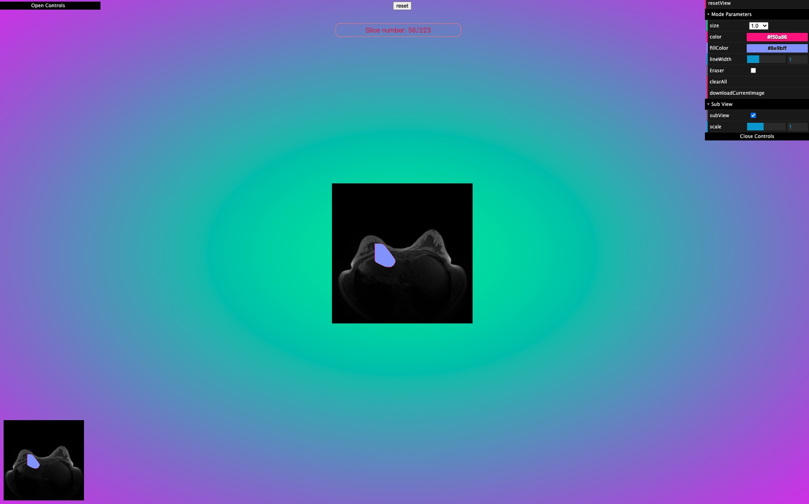

# New Drawing function

- Html

```html
<template>
  <div id="bg" ref="base_container">
    <div ref="c_gui" id="gui"></div>
    <div ref="c_gui_2" id="gui_2"></div>
    <button class="btn" ref="btn" @click="reset">reset</button>
  </div>
</template>
```

```css

<style lang="scss">
#bg {
  width: 100vw;
  height: 100vh;
  /* border: 1px solid palevioletred; */
}
.btn {
  position: fixed;
  left: 500;
  top: 0;
  z-index: 1000;
}
button {
  cursor: pointer;
  margin: 10px;
}
#gui {
  position: absolute;
  top: 10px;
  left: 2px;
  z-index: 100;
}
.copper3d_sliceNumber {
  position: fixed !important;
  width: 300px;
  text-align: center;
  top: 5% !important;
  right: 1% !important;
  // top: 50px !important;
  left: 0px !important;
  margin: 0 auto;
  border: 1px solid salmon;
  border-radius: 10px;
  padding: 5px;
  color: crimson;
}
.copper3D_scene_div {
  display: flex;
  justify-content: center;
  align-items: center;
}
</style>
```

- config copper3D

```ts
import { GUI } from "dat.gui";
import * as Copper from "copper3d_visualisation";
import "copper3d_visualisation/dist/css/style.css";

import { getCurrentInstance, onMounted, ref } from "vue";

let refs = null;
let bg: HTMLDivElement = ref<any>(null);
let appRenderer: Copper.copperMSceneRenderer;
let c_gui: HTMLDivElement = ref<any>(null);

onMounted(() => {
  let { $refs } = (getCurrentInstance() as any).proxy;
  refs = $refs;
  bg = refs.base_container;
  c_gui = refs.c_gui;

  appRenderer = new Copper.copperMSceneRenderer(bg, 1);

  /**
   * Call sub view
   */
  appRenderer.sceneInfos[0].addSubView();

  loadNrrd(
    "/copper3d_examples/nrrd/breast-224.nrrd",
    "nrrd0",
    appRenderer.sceneInfos[0],
    c_gui
  );

  appRenderer.animate();
});

function reset() {
  appRenderer.sceneInfos.forEach((sceneInfo) => {
    sceneInfo.resetView();
  });
}
```

- load NRRD image

```ts
function loadNrrd(
  url: string,
  name: string,
  sceneIn: Copper.copperMScene,
  c_gui: any
) {
  const opts: Copper.optsType = {
    openGui: true,
    container: c_gui,
  };

  const funa = (
    volume: any,
    nrrdMesh: Copper.nrrdMeshesType,
    nrrdSlices: Copper.nrrdSliceType,
    gui?: GUI
  ) => {
    (gui as GUI).closed = true;
    /**
     * for test 1 view
     * */
    appRenderer.sceneInfos[0].loadViewUrl("/copper3d_examples/nrrd_view.json");
    // appRenderer.sceneInfos[0].scene.add(nrrdMesh.z);

    appRenderer.sceneInfos[0].subScene.add(nrrdMesh.z);
    appRenderer.sceneInfos[0].dragImage(nrrdSlices.z, {
      mode: "mode1",
      showNumber: true,
    });
    appRenderer.sceneInfos[0].drawImage(
      nrrdSlices.z,
      appRenderer.sceneInfos[0]
    );
  };
  if (sceneIn) {
    sceneIn?.loadNrrd(url, funa, opts);
    sceneIn.loadViewUrl("/copper3d_examples/nrrd_view.json");
  }
  sceneIn.updateBackground("#18e5a7", "#ff00ff");
  Copper.setHDRFilePath("venice_sunset_1k.hdr");
  appRenderer.updateEnvironment(sceneIn);
}
```

## result


