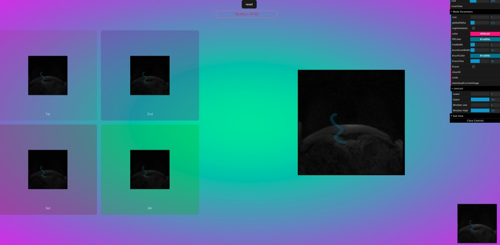

# Draw All Contrast Nrrds with MainArea (outdated)

- Html

```html
<template>
  <div id="bg" ref="base_container">
    <div ref="c_gui" id="gui"></div>
    <div ref="c_gui_2" id="gui_2"></div>
    <button class="btn" ref="btn" @click="reset">reset</button>
  </div>
</template>
```

```css

<style lang="scss">
#bg {
  width: 100vw;
  height: 100vh;
}
.btn {
  position: fixed;
  left: 500;
  top: 0;
  z-index: 1000;
}
button {
  cursor: pointer;
  margin: 10px;
}
#gui {
  position: absolute;
  top: 10px;
  left: 2px;
  width: 10vw;
  height: 10vh;

  z-index: 100;
}
.copper3d_sliceNumber {
  position: fixed !important;
  width: 300px;
  text-align: center;
  top: 5% !important;
  right: 1% !important;
  // top: 50px !important;
  left: 0px !important;
  margin: 0 auto;
  border: 1px solid salmon;
  border-radius: 10px;
  padding: 5px;
  color: crimson;
}
.copper3D_drawingCanvasContainer {
  max-width: 65vw;
  max-height: 65vh;
}
.copper3D_scene_div {
  display: grid;
  grid-template-areas:
    "z z m m m"
    "c1 c2 m m m"
    "c1 c2 m m m"
    "c1 c2 m m m"
    "c3 c4 m m m"
    "c3 c4 m m m"
    "c3 c4 m m m"
    "b b m m m";
  gap: 10px;
}
.copper3D_mainDisplay {
  position: relative;
  grid-area: m;
  z-index: 10;
}
.copper3D_contrast1 {
  grid-area: c1;
  background-color: rgba(130, 39, 39, 0.1);
}
.copper3D_contrast2 {
  grid-area: c2;
  background-color: rgba(102, 51, 153, 0.3);
}
.copper3D_contrast3 {
  grid-area: c3;
  background-color: rgba(126, 60, 60, 0.3);
}
.copper3D_contrast4 {
  grid-area: c4;
  background-color: rgba(45, 192, 19, 0.3);
}
</style>
```

- config copper3D

```ts
import { TrackballControls } from "three/examples/jsm/controls/TrackballControls";
import { GUI } from "dat.gui";
import * as Copper from "copper3d_visualisation";
import "copper3d_visualisation/dist/css/style.css";
import { getCurrentInstance, onMounted, ref } from "vue";

let refs = null;
let bg: HTMLDivElement = ref<any>(null);
let appRenderer: Copper.copperMSceneRenderer;
let c_gui: HTMLDivElement = ref<any>(null);
let nrrdTools: Copper.nrrd_tools;
let loadBar1: Copper.loadingBarType;
let loadBar2: Copper.loadingBarType;
let loadBar3: Copper.loadingBarType;
let loadBar4: Copper.loadingBarType;
let loadBar5: Copper.loadingBarType;

onMounted(() => {
  let { $refs } = (getCurrentInstance() as any).proxy;
  refs = $refs;
  bg = refs.base_container;
  c_gui = refs.c_gui;

  appRenderer = new Copper.copperMSceneRenderer(bg, 1);
  nrrdTools = new Copper.nrrd_tools(appRenderer.sceneInfos[0].container);
  nrrdTools.addContrastDisplay();
  loadBar1 = Copper.loading();
  loadBar2 = Copper.loading();
  loadBar3 = Copper.loading();
  loadBar4 = Copper.loading();
  loadBar5 = Copper.loading();

  nrrdTools.mainDisplayArea.appendChild(loadBar1.loadingContainer);
  nrrdTools.contrast1Area.appendChild(loadBar2.loadingContainer);
  nrrdTools.contrast2Area.appendChild(loadBar3.loadingContainer);
  nrrdTools.contrast3Area.appendChild(loadBar4.loadingContainer);
  nrrdTools.contrast4Area.appendChild(loadBar5.loadingContainer);

  const gui = appRenderer.sceneInfos[0].gui;
  const s = {
    size: 200,
  };
  gui
    .add(s, "size")
    .min(100)
    .max(400)
    .onChange((size) => {
      nrrdTools.setContrastSize(size, size);
      nrrdTools.updateContrastArea();
    });

  appRenderer.sceneInfos[0].addSubView();

  loadNrrd(
    "/copper3d_examples/nrrd/segmentation/ax dyn pre.nrrd",
    "nrrd0",
    appRenderer.sceneInfos[0],
    c_gui
  );

  appRenderer.animate();
});

function reset() {
  appRenderer.sceneInfos.forEach((sceneInfo) => {
    sceneInfo.resetView();
  });
}
```

- load NRRD image

```ts
function loadNrrd(
  url: string,
  name: string,
  sceneIn: Copper.copperMScene,
  c_gui: any
) {
  const mainPreArea = (
    volume: any,
    nrrdMesh: Copper.nrrdMeshesType,
    nrrdSlices: Copper.nrrdSliceType
    // gui?: GUI
  ) => {
    appRenderer.sceneInfos[0].loadViewUrl("/copper3d_examples/nrrd_view.json");

    appRenderer.sceneInfos[0].subScene.add(nrrdMesh.z);

    nrrdTools.setVolumeAndSlice(volume, nrrdSlices.z);

    nrrdTools.dragImageWithMode(sceneIn.controls as TrackballControls, {
      mode: "mode1",
      showNumber: true,
    });
    nrrdTools.draw(sceneIn.controls as TrackballControls, sceneIn, sceneIn.gui);
    appRenderer.sceneInfos[0].addPreRenderCallbackFunction(nrrdTools.start);
  };
  const contrast1Area = (
    volume: any,
    nrrdMesh: Copper.nrrdMeshesType,
    nrrdSlices: Copper.nrrdSliceType
  ) => {
    nrrdTools.setContrast1OriginCanvas(nrrdSlices.z);
  };
  const contrast2Area = (
    volume: any,
    nrrdMesh: Copper.nrrdMeshesType,
    nrrdSlices: Copper.nrrdSliceType
  ) => {
    nrrdTools.setContrast2OriginCanvas(nrrdSlices.z);
  };
  const contrast3Area = (
    volume: any,
    nrrdMesh: Copper.nrrdMeshesType,
    nrrdSlices: Copper.nrrdSliceType
  ) => {
    nrrdTools.setContrast3OriginCanvas(nrrdSlices.z);
  };
  const contrast4Area = (
    volume: any,
    nrrdMesh: Copper.nrrdMeshesType,
    nrrdSlices: Copper.nrrdSliceType
  ) => {
    nrrdTools.setContrast4OriginCanvas(nrrdSlices.z);
  };
  if (sceneIn) {
    sceneIn?.loadNrrd(url, loadBar1, mainPreArea);
    sceneIn?.loadNrrd(
      "/copper3d_examples/nrrd/segmentation/ax dyn 1st pass.nrrd",
      loadBar2,
      contrast1Area
    );
    sceneIn?.loadNrrd(
      "/copper3d_examples/nrrd/segmentation/ax dyn 2nd pass.nrrd",
      loadBar3,
      contrast2Area
    );
    sceneIn?.loadNrrd(
      "/copper3d_examples/nrrd/segmentation/ax dyn 3rd pass.nrrd",
      loadBar4,
      contrast3Area
    );
    sceneIn?.loadNrrd(
      "/copper3d_examples/nrrd/segmentation/ax dyn 4th pass.nrrd",
      loadBar5,
      contrast4Area
    );
    sceneIn.loadViewUrl("/copper3d_examples/nrrd_view.json");
  }
  sceneIn.updateBackground("#18e5a7", "#ff00ff");
  Copper.setHDRFilePath("venice_sunset_1k.hdr");
  appRenderer.updateEnvironment(sceneIn);
}
```

## result


