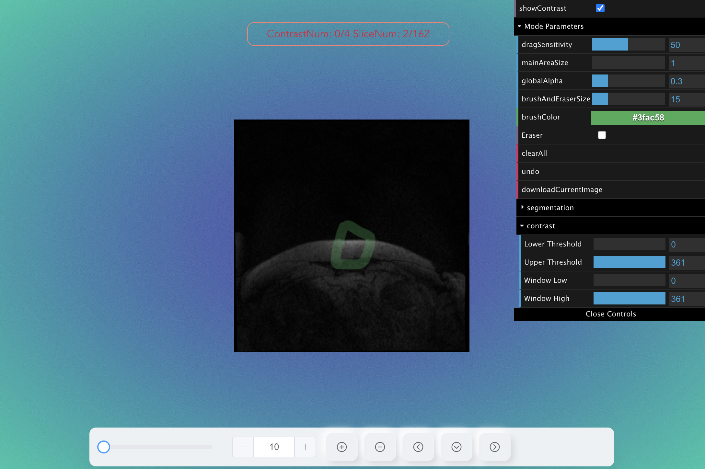

# Draw Contrast In MainArea

## Main page

- Html

```html
<template>
  <div id="bg" ref="base_container">
    <div ref="c_gui" id="gui"></div>
    <div ref="nrrd_c" class="nrrd_c"></div>
    <NavBar
      :file-num="fileNum"
      :max="max"
      :immediate-slice-num="immediateSliceNum"
      :contrast-index="contrastNum"
      :is-axis-clicked="isAxisClicked"
      :init-slice-index="initSliceIndex"
      @on-slice-change="getSliceChangedNum"
      @reset-main-area-size="resetMainAreaSize"
      @on-change-orientation="resetSlicesOrientation"
      @on-open-dialog="onOpenDialog"
    ></NavBar>
    <Upload
      :dialog="dialog"
      @on-close-dialog="onCloseDialog"
      @get-load-files-urls="readyToLoad"
    ></Upload>
  </div>
</template>
```

```css

<style lang="scss">
#bg {
  width: 100vw;
  height: 100vh;
  /* border: 1px solid palevioletred; */
  overflow: hidden;
}
#gui {
  position: absolute;
  top: 1px;
  right: 0px;
  z-index: 100;
  -webkit-user-select: none;
  -moz-user-select: none;
  -ms-user-select: none;
  user-select: none;
}

.nrrd_c {
  position: fixed;
  width: 100vw;
  height: 100vh;
  display: flex;
  justify-content: center;
  align-items: center;
}

.copper3d_sliceNumber {
  position: fixed !important;
  width: 300px;
  text-align: center;
  top: 5% !important;
  right: 1% !important;
  left: 0px !important;
  margin: 0 auto;
  border: 1px solid salmon;
  border-radius: 10px;
  padding: 5px;
  color: crimson;
}
.copper3D_loading_progress {
  color: crimson !important;
}
</style>
```

- config copper3D

```ts
import * as Copper from "copper3d_visualisation";
import "copper3d_visualisation/dist/css/style.css";
import { GUI } from "dat.gui";
import { TrackballControls } from "three/examples/jsm/controls/TrackballControls";
import { getCurrentInstance, onMounted, ref, watchEffect, reactive } from "vue";
import NavBar from "../components/NavBar.vue";
import Upload from "../components/Upload.vue";

let refs = null;
let appRenderer: Copper.copperRenderer;
let max = ref(0);
let immediateSliceNum = ref(0);
let contrastNum = ref(0);
let isAxisClicked = ref(false);
let dialog = ref(false);
let initSliceIndex = ref(0);
let scene: Copper.copperScene | undefined;
let bg: HTMLDivElement = ref<any>(null);
let c_gui: HTMLDivElement = ref<any>(null);
let nrrd_c: HTMLDivElement = ref<any>(null);
let pre_slices = ref();
let gui = new GUI({ width: 300, autoPlace: false });
let selectedContrastFolder: GUI;
let nrrdTools: Copper.nrrd_tools;
let loadBarMain: Copper.loadingBarType;
let urls: Array<string> = [];
let filesCount = ref(0);
let fileNum = ref(0);
let firstLoad = true;
let allSlices: Array<any> = [];

type selecedType = {
  [key: string]: boolean;
};

onMounted(() => {
  let { $refs } = (getCurrentInstance() as any).proxy;
  refs = $refs;

  bg = refs.base_container;
  c_gui = $refs.c_gui;
  nrrd_c = $refs.nrrd_c;
  c_gui.appendChild(gui.domElement);
  appRenderer = new Copper.copperRenderer(bg);
  loadBarMain = Copper.loading();
  nrrdTools = new Copper.nrrd_tools(nrrd_c);
  nrrd_c.appendChild(loadBarMain.loadingContainer);

  loadModel("nrrd_tools");

  document.addEventListener("keydown", (e) => {
    if (e.code === "KeyF") {
      Copper.fullScreenListenner(bg);
    }
  });
  const state = {
    showContrast: false,
  };

  gui.add(state, "showContrast").onChange((flag) => {
    nrrdTools.setShowInMainArea(flag);
    isAxisClicked.value = false;
    if (flag) {
      max.value = nrrdTools.getMaxSliceNum()[1];
    } else {
      max.value = nrrdTools.getMaxSliceNum()[0];
    }
  });
  selectedContrastFolder = gui.addFolder("select display contrast");
  appRenderer.animate();
});
```

- config copper3d environment

```ts
function loadModel(name: string) {
  scene = appRenderer.getSceneByName(name) as Copper.copperScene;
  if (scene == undefined) {
    scene = appRenderer.createScene(name) as Copper.copperScene;

    if (scene) {
      // const sub = scene.addSubView();
      // nrrd_c.appendChild(sub);
      appRenderer.setCurrentScene(scene);

      if (scene) {
        // loadAllNrrds(urls);
        scene.loadViewUrl("/copper3d_examples/nrrd_view.json");
      }
      Copper.setHDRFilePath("/copper3d_examples/venice_sunset_1k.hdr");

      scene.updateBackground("#5454ad", "#18e5a7");
    }

    appRenderer.updateEnvironment();
  }
}
```

- setup opreation functions

```ts
const readyToLoad = (urlsArray: Array<string>) => {
  fileNum.value = urlsArray.length;
  urls = urlsArray;
  if (urls.length > 0) loadAllNrrds(urls);
};

const onOpenDialog = (flag: boolean) => {
  dialog.value = flag;
};
const onCloseDialog = (flag: boolean) => {
  dialog.value = flag;
};
const resetSlicesOrientation = (axis: "x" | "y" | "z") => {
  nrrdTools.setSliceOrientation(axis);
  const status = nrrdTools.getIsShowContrastState();
  isAxisClicked.value = true;
  if (status) {
    max.value = nrrdTools.getMaxSliceNum()[1];
  } else {
    max.value = nrrdTools.getMaxSliceNum()[0];
  }
};
const getSliceChangedNum = (sliceNum: number) => {
  nrrdTools.setSliceMoving(sliceNum);
};
const resetMainAreaSize = (factor: number) => {
  nrrdTools.setMainAreaSize(factor);
};
```

- watch changes after load all files and config nrrd_tools

```ts
watchEffect(() => {
  if (
    filesCount.value != 0 &&
    allSlices.length != 0 &&
    filesCount.value === urls.length
  ) {
    console.log("All files ready!");
    nrrdTools.clear();
    allSlices.sort((a: any, b: any) => {
      return a.order - b.order;
    });

    nrrdTools.setAllSlices(allSlices);
    initSliceIndex.value = nrrdTools.getCurrentSliceIndex();

    const getSliceNum = (index: number, contrastindex: number) => {
      immediateSliceNum.value = index;
      contrastNum.value = contrastindex;
    };
    if (firstLoad) {
      nrrdTools.drag({
        showNumber: true,
        getSliceNum,
      });
      nrrdTools.draw(scene as Copper.copperScene, gui);

      scene?.addPreRenderCallbackFunction(nrrdTools.start);
    } else {
      nrrdTools.redrawMianPreOnDisplayCanvas();
    }

    max.value = nrrdTools.getMaxSliceNum()[0];
    filesCount.value = 0;
    firstLoad = false;

    const selectedState: selecedType = {};

    for (let i = 0; i < allSlices.length - 1; i++) {
      const key = "contrast" + i;
      selectedState[key] = true;
    }

    nrrdTools.removeGuiFolderChilden(selectedContrastFolder);
    for (let i = 0; i < allSlices.length - 1; i++) {
      selectedContrastFolder
        .add(selectedState, "contrast" + i)
        .onChange((flag) => {
          if (flag) {
            fileNum.value += 1;
            nrrdTools.removeSkip(i);
          } else {
            fileNum.value -= 1;
            nrrdTools.addSkip(i);
          }
        });
    }
  }
});
```

- load NRRD image

```ts
const loadAllNrrds = (urls: Array<string>) => {
  allSlices = [];
  const mainPreArea = (
    volume: any,
    nrrdMesh: Copper.nrrdMeshesType,
    nrrdSlices: Copper.nrrdSliceType
    // gui?: GUI
  ) => {
    const newNrrdSlice = Object.assign(nrrdSlices, { order: 0 });
    allSlices.push(newNrrdSlice);
    volume1 = volume;
    // scene?.subScene.add(nrrdMesh.z);
    pre_slices.value = nrrdSlices;

    // readyMain.value = true;
    filesCount.value += 1;
  };
  scene?.loadNrrd(urls[0], loadBarMain, mainPreArea);

  for (let i = 1; i < urls.length; i++) {
    scene?.loadNrrd(
      urls[i],
      loadBarMain,
      (
        volume: any,
        nrrdMesh: Copper.nrrdMeshesType,
        nrrdSlices: Copper.nrrdSliceType
      ) => {
        const newNrrdSlice = Object.assign(nrrdSlices, { order: i });
        allSlices.push(newNrrdSlice);
        filesCount.value += 1;
      }
    );
  }
};
```

## Component NavBar

- html

```html
<template>
  <div class="nav">
    <div class="content">
      <el-slider
        v-model="sliceNum"
        :max="p.max"
        @input="onChangeSlider"
        show-input
      />
      <div class="arrows">
        <span @click="onMagnificationClick(0.2)"
          ><ion-icon name="add-circle-outline"></ion-icon
        ></span>
        <span @click="onMagnificationClick(-0.2)"
          ><ion-icon name="remove-circle-outline"></ion-icon
        ></span>
        <span @click="onSwitchSliceOrientation('x')"
          ><ion-icon name="chevron-back-circle-outline"></ion-icon
        ></span>
        <span @click="onSwitchSliceOrientation('z')"
          ><ion-icon name="chevron-down-circle-outline"></ion-icon
        ></span>
        <span @click="onSwitchSliceOrientation('y')"
          ><ion-icon name="chevron-forward-circle-outline"></ion-icon
        ></span>
        <span @click="openDialog">
          <ion-icon name="cloud-upload-outline"></ion-icon>
        </span>
      </div>
    </div>
  </div>
</template>
```

- css

```css
.el-slider {
  max-width: 30vw;
  margin-right: 10px;
  --el-slider__bar-bg-color: red !important;
}
.nav {
  position: fixed;
  bottom: 10px;
  height: 60px;
  width: 100%;
  display: flex;
  justify-content: center;
  align-items: center;
  z-index: 100;
  -webkit-user-select: none;
  -moz-user-select: none;
  -ms-user-select: none;
  user-select: none;
}
.nav .content {
  position: relative;
  width: 70%;
  height: 100%;
  background-color: #edf1f4;
  padding: 0 20px;
  border-radius: 10px;
  box-shadow: 0 30px 30px rgba(0, 0, 0, 0.05);
  display: flex;
  align-items: center;
}
.nav .content .arrows {
  display: flex;
  align-items: center;
}
.nav .content .arrows span {
  position: relative;
  padding: 10px;
  box-shadow: 5px 5px 10px rgba(0, 0, 0, 0.1), -5px -5px 20px #fff;
  margin: 5px;
  cursor: pointer;
  user-select: none;
  min-width: 25px;
  display: flex;
  justify-content: center;
  align-items: center;
  font-size: 1.2em;
  color: #666;
  border: 2px solid #edf1f4;
  box-shadow: 5px 5px 10px rgba(0, 0, 0, 0.1), -5px -5px 10px #fff;
  border-radius: 10px;
  cursor: pointer;
}
.nav .content .arrows span:active {
  box-shadow: inset 5px 5px 10px rgba(0, 0, 0, 0.1), inset -5px -5px 10px #fff;
  color: #f44336;
}
```

- ts

```ts
import { ref, reactive, toRefs, watchEffect } from "vue";
type Props = {
  fileNum: number;
  min?: number;
  max?: number;
  initSliceIndex?: number;
  immediateSliceNum?: number;
  contrastIndex?: number;
  isAxisClicked?: boolean;
};
let p = withDefaults(defineProps<Props>(), {
  min: 0,
  max: 160,
  immediateSliceNum: 0,
  contrastIndex: 0,
  isAxisClicked: false,
});
const state = reactive(p);
const {
  max,
  immediateSliceNum,
  contrastIndex,
  isAxisClicked,
  initSliceIndex,
  fileNum,
} = toRefs(state);
const sliceNum = ref(0);
let preViousSliceNum = p.min;
let previousMax = 0;
let isShowContrast = false;
let count = 0;
let magnification = 1;
let filesNum = 0;

const emit = defineEmits([
  "onSliceChange",
  "resetMainAreaSize",
  "onChangeOrientation",
  "onOpenDialog",
]);

const openDialog = () => {
  emit("onOpenDialog", true);
};

const onSwitchSliceOrientation = (axis: string) => {
  emit("onChangeOrientation", axis);
};

const onMagnificationClick = (factor: number) => {
  magnification += factor;
  if (magnification > 8) {
    magnification = 8;
  }
  if (magnification < 1) {
    magnification = 1;
  }
  emit("resetMainAreaSize", magnification);
};

const onChangeSlider = () => {
  preViousSliceNum > max.value
    ? (preViousSliceNum = max.value)
    : preViousSliceNum;
  const step = sliceNum.value - preViousSliceNum;
  emit("onSliceChange", step);
  preViousSliceNum += step;
};

// const needToUpdatePre = () => {
//   emit("redrawPre");
// };

watchEffect(() => {
  initSliceIndex?.value && (sliceNum.value = initSliceIndex.value);
});
watchEffect(() => {
  filesNum = fileNum.value;
});

watchEffect(() => {
  if (isShowContrast) {
    sliceNum.value =
      immediateSliceNum.value * fileNum.value + contrastIndex.value;
  } else {
    sliceNum.value = immediateSliceNum.value;
  }
});

watchEffect(() => {
  if (!isAxisClicked.value) {
    if (max.value > previousMax) {
      sliceNum.value = sliceNum.value * filesNum;
      if (count !== 0) isShowContrast = true;
      count++;
    }
    if (max.value < previousMax) {
      sliceNum.value = Math.floor(sliceNum.value / filesNum);
      isShowContrast = false;
    }
    preViousSliceNum = sliceNum.value;
    previousMax = max.value;
  }
});
```

## Component Upload

- Html

```html
<template>
  <div v-if="dialog" @click="closeDialog" class="upload_container">
    <el-upload
      :auto-upload="false"
      @change="loaded"
      @remove="removeLoadFile"
      class="upload-demo"
      drag
      action="/"
      multiple
    >
      <el-icon class="el-icon--upload"><upload-filled /></el-icon>
      <div class="el-upload__text">
        Drop file here or <em>click to upload</em>
      </div>
      <template #tip>
        <div class="el-upload__tip">Please drag or upload NRRD files!</div>
      </template>
    </el-upload>
  </div>
</template>
```

- Css

```css
.upload_container {
  position: fixed;
  z-index: 1000;
  width: 100vw;
  height: 100vh;
  background-color: rgba(0, 0, 0, 0.7);
  display: flex;
  align-items: center;
  justify-content: center;
}
.upload-demo {
  width: 60vw;
}
```

- Ts

```ts
import { UploadFilled } from "@element-plus/icons-vue";
import type { UploadFile } from "element-plus";

type Props = {
  dialog?: boolean;
};

withDefaults(defineProps<Props>(), {
  dialog: false,
});

let files: Array<File> = [];
let urls: Array<string> = [];
let loadedFiles = false;

const emit = defineEmits(["onCloseDialog", "getLoadFilesUrls"]);
const closeDialog = (e: MouseEvent) => {
  let e1 = e.currentTarget;
  let e2 = e.target;
  if (e1 === e2) {
    // openDialog.value = false;
    files.forEach((file) => {
      const url = URL.createObjectURL(file);
      urls.push(url);
    });
    emit("getLoadFilesUrls", urls);
    emit("onCloseDialog", false);
    loadedFiles = true;
    resetLoadState();
  }
};

const resetLoadState = () => {
  files = [];
  urls.forEach((url) => {
    URL.revokeObjectURL(url);
  });
  urls = [];
};

const loaded = (uploadFile: UploadFile) => {
  //   console.log(uploadFile);
  //   console.log(uploadFile.name);
  //   console.log(uploadFile.raw);
  if (loadedFiles) {
    loadedFiles = false;
    resetLoadState();
  }

  let filename = uploadFile.name;
  let file: File | undefined;
  if (filename.match(/\.(nrrd)$/)) {
    file = uploadFile.raw as File;
    files.push(file);
  }
  if (!file) {
    onError("No .nrrd asset found!");
  }
};

const removeLoadFile = (uploadFile: UploadFile) => {
  files = files.filter((file) => {
    return file.name !== uploadFile.name;
  });
  console.log(files);
};

/**
 * @param  {Error} error
 */
const onError = (error: string | Error) => {
  let message = ((error as Error) || {}).message || error.toString();
  if (message.match(/ProgressEvent/)) {
    message =
      "Unable to retrieve this file. Check JS console and browser network tab.";
  } else if (message.match(/Unexpected token/)) {
    message = `Unable to parse file content. Verify that this file is valid. Error: "${message}"`;
  } else if (
    error &&
    (error as any).target &&
    (error as any).target instanceof Image
  ) {
    message = "Missing texture: " + (error as any).target.src.split("/").pop();
  }
  window.alert(message);
  console.error(error);
};
```

## result


